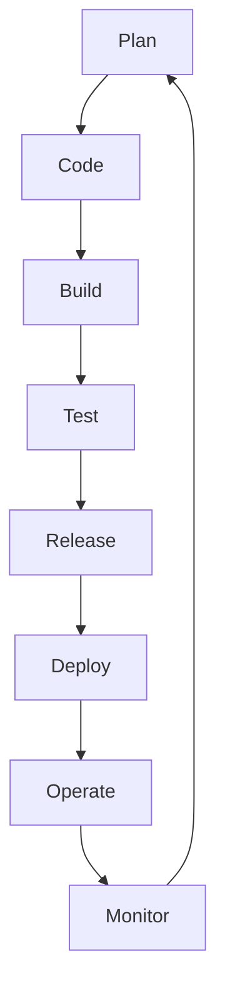

# Python Advanced 4.1: DevOps and Deployment

## Table of Contents
- [Introduction](#introduction)
- [Containerization](#containerization)
  - [Docker Fundamentals](#docker-fundamentals)
  - [Creating Docker Images for Python Apps](#creating-docker-images-for-python-apps)
  - [Docker Compose for Multi-Container Apps](#docker-compose-for-multi-container-apps)
- [Cloud Deployment](#cloud-deployment)
  - [AWS/GCP/Azure Basics](#awsgcpazure-basics)
  - [Serverless Computing (AWS Lambda)](#serverless-computing-aws-lambda)
  - [CI/CD Pipelines](#cicd-pipelines)
  - [Monitoring and Logging](#monitoring-and-logging)
- [Review Questions](#review-questions)
- [Answers to Review Questions](#answers-to-review-questions)

---


## Introduction
DevOps and deployment are essential skills for advanced Python developers. This module provides a deep dive into the tools, practices, and mindset required to build, package, deploy, and maintain Python applications in modern production environments. The focus is on automation, scalability, reliability, security, and seamless collaboration between development and operations teams.

DevOps is not just a set of tools, but a cultural movement that bridges the gap between software development (Dev) and IT operations (Ops). Its primary goals are to shorten the development lifecycle, increase deployment frequency, improve product quality, and enable rapid, reliable delivery of features and fixes. Deployment, in this context, refers to the process of making an application available for use, which includes packaging, distributing, configuring, and running the application in a target environment, often with zero downtime and automated rollback capabilities.

### Key DevOps Principles
- **Automation:** Automate repetitive tasks such as testing, building, deployment, infrastructure provisioning, and monitoring. Automation reduces human error, increases speed, and ensures consistency.
- **Continuous Integration/Continuous Deployment (CI/CD):** Integrate and deliver code changes frequently and reliably. CI/CD pipelines automate the process from code commit to deployment, enabling rapid feedback and faster innovation.
- **Infrastructure as Code (IaC):** Manage and provision infrastructure using code and automation tools (e.g., Terraform, CloudFormation). IaC enables versioning, repeatability, and disaster recovery.
- **Monitoring and Feedback:** Continuously monitor systems, gather feedback, and use metrics to drive improvements. Monitoring includes application performance, infrastructure health, and user experience.
- **Collaboration:** Foster communication and shared responsibility between developers, QA, and operations. Use tools like chatops, shared dashboards, and blameless postmortems.
- **Security (DevSecOps):** Integrate security practices into every stage of the DevOps lifecycle, including automated vulnerability scanning, secrets management, and compliance checks.

### DevOps Lifecycle Diagram



This cycle is continuous, with feedback loops at every stage.


## Containerization

Containerization is a method of packaging an application and its dependencies into a single, portable unit called a container. Containers provide process and filesystem isolation, ensuring that applications run consistently across different environments (development, testing, production, cloud, on-premises). Unlike virtual machines, containers share the host OS kernel, making them lightweight and fast to start.

### Docker Fundamentals
Docker is the de facto standard for containerization. It provides tools to build, ship, and run containers. Containers encapsulate an application, its libraries, and configuration files, but share the host OS kernel, making them more efficient than VMs.

**Key Concepts:**
- **Image:** A read-only template with instructions for creating a container. Images are built from Dockerfiles and can be versioned and shared via registries.
- **Container:** A runnable instance of an image. Containers are isolated, ephemeral, and can be started, stopped, or destroyed quickly.
- **Dockerfile:** A text file with step-by-step instructions to build a Docker image. Supports commands like `FROM`, `RUN`, `COPY`, `CMD`, `ENTRYPOINT`, and more.
- **Registry:** A storage and distribution system for Docker images. Public (Docker Hub) and private (AWS ECR, GCR, Azure Container Registry) options exist.

**Benefits:**
- **Portability:** Run the same container image on any system with Docker support.
- **Isolation:** Each container runs in its own namespace, reducing conflicts.
- **Reproducibility:** Images are immutable and versioned, ensuring consistent deployments.
- **Scalability:** Containers can be orchestrated (e.g., with Kubernetes) for horizontal scaling.
- **Resource Efficiency:** Containers are lightweight, with minimal overhead compared to VMs.

**Best Practices:**
- Use official, minimal base images (e.g., `python:3.11-slim`)
- Pin dependency versions in `requirements.txt` and Dockerfile
- Minimize image size (multi-stage builds, remove build tools after use)
- Use `.dockerignore` to exclude unnecessary files (e.g., `.git`, `__pycache__`)
- Run as a non-root user inside containers for security
- Keep containers stateless; use volumes or external storage for persistent data
- Regularly scan images for vulnerabilities (Trivy, Snyk)
- Use health checks to monitor container health

**Real-World Example:**
Suppose you have a Flask web application. A production-ready Dockerfile might look like:
```Dockerfile
FROM python:3.11-slim
WORKDIR /app
COPY requirements.txt .
RUN pip install --no-cache-dir -r requirements.txt
COPY . .
EXPOSE 5000
USER nobody
CMD ["gunicorn", "app:app", "-b", "0.0.0.0:5000"]
```
This uses Gunicorn for production serving, runs as a non-root user, and exposes the correct port.


### Creating Docker Images for Python Apps
The process of containerizing a Python application involves writing a Dockerfile, building the image, and running containers. This enables consistent, repeatable deployments across all environments.

**Step-by-Step Example:**
1. **Write a Dockerfile:**
   - Choose a minimal base image (e.g., `python:3.11-slim`)
   - Set the working directory
   - Copy dependency files and install dependencies
   - Copy application code
   - Set environment variables and entrypoint
   - Use a production-ready server (e.g., Gunicorn for web apps)

   Example:
   ```Dockerfile
   FROM python:3.11-slim
   WORKDIR /app
   COPY requirements.txt .
   RUN pip install --no-cache-dir -r requirements.txt
   COPY . .
   ENV ENV=production
   EXPOSE 8000
   USER nobody
   CMD ["gunicorn", "main:app", "-b", "0.0.0.0:8000"]
   ```
2. **Build the image:**
   ```bash
   docker build -t my-python-app:latest .
   ```
3. **Run the container:**
   ```bash
   docker run -d -p 8000:8000 --name myapp my-python-app:latest
   ```
4. **Set environment variables:**
   - Use the `ENV` instruction in Dockerfile for defaults
   - Override with `-e` flag in `docker run` for secrets/config
5. **Use volumes for development:**
   ```bash
   docker run -v $(pwd):/app my-python-app:latest
   ```

**Advanced Topics:**
- **Multi-stage builds:** Use multiple `FROM` statements to separate build and runtime environments, reducing image size.
- **Health checks:** Add `HEALTHCHECK` to Dockerfile to monitor container health and enable automated restarts.
- **Custom entrypoints:** Use `ENTRYPOINT` for scripts that initialize the app (e.g., migrations, config setup).
- **Security scanning:** Integrate tools like Trivy or Snyk into CI/CD to detect vulnerabilities in images.
- **Image signing:** Use Docker Content Trust or Notary for image integrity.


### Docker Compose for Multi-Container Apps
Modern applications often require multiple services (e.g., web server, database, cache) to work together. Docker Compose allows you to define, configure, and run multi-container applications using a single YAML file (`docker-compose.yml`).

**Example Compose File:**
```yaml
version: '3.8'
services:
  web:
    build: .
    ports:
      - "8000:8000"
    environment:
      - ENV=production
    depends_on:
      - db
  db:
    image: postgres:15
    environment:
      - POSTGRES_USER=admin
      - POSTGRES_PASSWORD=secret
    volumes:
      - pgdata:/var/lib/postgresql/data
  redis:
    image: redis:7
    ports:
      - "6379:6379"
volumes:
  pgdata:
```

**Key Features:**
- Define networks, volumes, and dependencies between services
- Use `depends_on` to control startup order
- Easily scale services with `docker-compose up --scale web=3`

**Commands:**
- `docker-compose up --build` (start all services)
- `docker-compose down` (stop and remove containers, networks, volumes)
- `docker-compose logs` (view logs for all services)
- `docker-compose exec web bash` (open a shell in a running container)

**Best Practices:**
- Use environment variables and `.env` files for secrets/configuration (never hardcode sensitive data)
- Separate development, staging, and production configurations using multiple Compose files or overrides
- Use named volumes for persistent data (e.g., databases)
- Monitor and log all services centrally


## Cloud Deployment

Cloud platforms provide scalable, reliable, and cost-effective infrastructure for deploying Python applications. They offer a range of services from raw virtual machines to fully managed serverless platforms. Understanding the trade-offs and best practices for each is crucial for advanced deployment strategies.

### AWS/GCP/Azure Basics

- **AWS EC2 (Elastic Compute Cloud):** Infrastructure-as-a-Service (IaaS) providing virtual servers. Offers full control over OS, networking, and installed software. Requires manual scaling and management.
- **AWS Elastic Beanstalk:** Platform-as-a-Service (PaaS) for deploying Python (and other) apps. Handles provisioning, load balancing, scaling, and monitoring. Supports Docker out of the box.
- **AWS Lambda:** Serverless compute for running Python functions in response to events. No server management, automatic scaling, pay-per-use.
- **GCP App Engine:** PaaS for Python with automatic scaling, versioning, and zero-downtime deployments. Supports both standard and flexible environments.
- **GCP Cloud Run:** Fully managed serverless platform for running containers. Scales to zero, supports any language/runtime.
- **Azure App Service:** Managed hosting for web apps, supports Python, autoscaling, custom domains, SSL, and CI/CD integration.
- **Azure Functions:** Serverless compute for event-driven Python code.

**Key Concepts:**
- **Regions, Zones, and Availability:** Deploy across multiple regions/zones for high availability and disaster recovery.
- **Instances, Scaling Groups, Load Balancers:** Use auto-scaling groups and load balancers for elasticity and fault tolerance.
- **Networking (VPC, Subnets, Firewalls):** Secure and segment your cloud network. Use private subnets for databases, public for web servers.
- **IAM (Identity and Access Management):** Fine-grained access control for users, services, and resources. Use least-privilege principle.
- **Cost Management and Billing:** Monitor usage, set budgets, and use cost optimization tools to avoid overruns.

**Best Practices:**
- Use Infrastructure as Code (IaC) tools (Terraform, CloudFormation, Pulumi) for repeatable, versioned infrastructure.
- Automate deployments with CI/CD pipelines.
- Secure credentials using managed secrets (AWS Secrets Manager, Azure Key Vault, GCP Secret Manager). Never commit secrets to version control.
- Monitor resource usage, set up alerts, and regularly review security policies.
- Use managed services (databases, caches, queues) where possible to reduce operational overhead.

**Real-World Example:**
Deploying a Python web app on AWS Elastic Beanstalk:
1. Package your app with a `requirements.txt` and `application.py`.
2. Install the AWS CLI and initialize Beanstalk: `eb init`.
3. Deploy: `eb create my-env` and `eb deploy`.
4. Monitor logs and health via the AWS Console or CLI.


### Serverless Computing (AWS Lambda)
Serverless computing is a cloud execution model where the cloud provider automatically manages the infrastructure, scaling, and resource allocation. Developers focus solely on writing code, which is executed in response to events (HTTP requests, file uploads, queue messages, etc.).

- **AWS Lambda:** Deploy Python functions that are triggered by events (API Gateway, S3, DynamoDB, etc.). Handles scaling, patching, and availability automatically. Billed per execution and duration.
- **GCP Cloud Functions / Azure Functions:** Similar serverless offerings with event-driven execution and automatic scaling.

**Benefits:**
- No server management or provisioning
- Automatic scaling to zero and up
- High availability and fault tolerance
- Cost efficiency (pay only for usage)

**Limitations:**
- Cold starts (latency on first invocation)
- Execution timeouts (e.g., 15 minutes for Lambda)
- Statelessness (must use external storage for state)
- Limited runtime environments and resources

**Deployment Tools:**
- **AWS SAM (Serverless Application Model):** Define serverless applications using YAML templates. Supports local testing and deployment.
- **Serverless Framework:** Multi-cloud framework for building and deploying serverless applications. Supports plugins and extensibility.
- **Terraform:** IaC tool for managing serverless resources alongside other infrastructure.

**Example Lambda Function:**
```python
import json
def handler(event, context):
    # event contains input data, context has metadata
    return {
        'statusCode': 200,
        'body': json.dumps('Hello from Lambda!')
    }
```

**Best Practices:**
- Keep functions small and single-purpose
- Use environment variables for configuration
- Monitor and log invocations (CloudWatch, Stackdriver)
- Secure access with IAM roles and policies
- Use layers for shared dependencies


### CI/CD Pipelines
Continuous Integration (CI) and Continuous Deployment/Delivery (CD) are foundational DevOps practices that automate the process of building, testing, and deploying code. They enable teams to deliver features, fixes, and updates rapidly and reliably.

- **CI:** Developers merge code changes into a shared repository frequently. Automated builds and tests validate each change, catching bugs early.
- **CD:** Automates the release process, deploying code to production (or staging) after passing all tests. Can be continuous delivery (manual approval for prod) or continuous deployment (fully automated to prod).

**Typical Pipeline Steps:**
1. Checkout code from version control (e.g., GitHub, GitLab)
2. Install dependencies
3. Run unit, integration, and end-to-end tests
4. Lint and static analysis (e.g., flake8, mypy)
5. Build Docker image (if containerized)
6. Push image to registry (Docker Hub, ECR, GCR)
7. Deploy to staging/production (via scripts, IaC, or cloud services)
8. Run post-deployment tests and health checks

**Example GitHub Actions Workflow:**
```yaml
name: CI/CD Pipeline
on:
  push:
    branches: [ main ]
jobs:
  build:
    runs-on: ubuntu-latest
    steps:
      - uses: actions/checkout@v3
      - name: Set up Python
        uses: actions/setup-python@v4
        with:
          python-version: '3.11'
      - name: Install dependencies
        run: pip install -r requirements.txt
      - name: Lint
        run: flake8 .
      - name: Type check
        run: mypy .
      - name: Run tests
        run: pytest
      - name: Build Docker image
        run: docker build -t my-python-app .
      - name: Push to Docker Hub
        run: docker push my-python-app
      - name: Deploy to Staging
        run: ./deploy.sh staging
```

**Best Practices:**
- Use secrets management for credentials (GitHub Secrets, Vault)
- Run tests in isolated, reproducible environments (Docker, VMs)
- Use blue/green or canary deployments for zero-downtime and safe rollouts
- Automate rollbacks on failure (monitor health checks, revert on error)
- Version artifacts and deployments for traceability
- Integrate security scans (SAST, DAST) into the pipeline


### Monitoring and Logging
Monitoring and logging are critical for maintaining application health, performance, security, and compliance. They provide visibility into system behavior, help detect and diagnose issues, and enable proactive responses to incidents.

- **Monitoring:** Collects and analyzes metrics (CPU, memory, latency, error rates, custom business metrics) to track system health and performance. Enables alerting and automated remediation.
- **Logging:** Captures detailed records of application and system events. Essential for debugging, auditing, and compliance.
- **Tracing:** Follows requests as they traverse distributed systems, helping diagnose bottlenecks and failures (e.g., OpenTelemetry, Jaeger).
- **Alerting:** Notifies teams of failures, anomalies, or threshold breaches via email, Slack, PagerDuty, etc.

**Tools:**
- **Prometheus:** Open-source metrics collection and alerting system. Integrates with exporters for Python (e.g., `prometheus_client`).
- **Grafana:** Visualization and dashboarding tool for metrics from Prometheus and other sources.
- **ELK Stack (Elasticsearch, Logstash, Kibana):** Centralized log aggregation, search, and visualization. Beats agents ship logs from containers/VMs.
- **Cloud-native tools:** AWS CloudWatch (metrics, logs, alarms), GCP Stackdriver, Azure Monitor.
- **OpenTelemetry:** Standard for distributed tracing and metrics.

**Best Practices:**
- Structure logs in machine-readable formats (e.g., JSON) for easier parsing and analysis
- Use correlation IDs to trace requests across services
- Set up automated alerts for critical metrics (e.g., error rate, latency, resource exhaustion)
- Regularly review, test, and update monitoring and alerting rules
- Store logs securely and manage retention for compliance
- Monitor both infrastructure and application-level metrics

**Example Monitoring Architecture:**

```mermaid
graph TD;
  A[Application] --> B[Prometheus Exporter];
  B --> C[Prometheus];
  C --> D[Grafana];
  A --> E[Log Shipper (Filebeat)];
  E --> F[Logstash];
  F --> G[Elasticsearch];
  G --> H[Kibana];
```


## Review Questions
1. What are the main benefits of using Docker for Python applications?
2. How does Docker Compose simplify multi-container deployments?
3. What are the differences between EC2, Elastic Beanstalk, App Engine, and Azure App Service?
4. Explain the concept of serverless computing and its advantages and limitations.
5. What is a CI/CD pipeline and why is it important?
6. Name two tools for monitoring and logging in production environments.
7. What are some best practices for writing Dockerfiles?
8. How can you secure secrets and credentials in cloud deployments?
9. What is Infrastructure as Code and why is it important?
10. Describe a blue/green deployment strategy.
11. What are the trade-offs between using managed services and self-hosted solutions in the cloud?
12. How can distributed tracing help in debugging microservices architectures?
13. What are the security considerations when deploying containers in production?
14. How do you ensure compliance and auditability in a DevOps pipeline?


## Answers to Review Questions
1. Docker provides portability, isolation, reproducibility, and scalability by packaging applications and dependencies together. It ensures consistent environments across development, testing, and production, simplifies deployment and scaling, and enables rapid recovery and rollbacks.
2. Docker Compose allows you to define and manage multiple containers as a single service, simplifying orchestration, networking, and configuration. It is especially useful for applications with multiple components (e.g., web + database + cache), and supports scaling and environment-specific overrides.
3. EC2 provides virtual machines with full control, Elastic Beanstalk is a PaaS for easy deployment and management, App Engine is a managed PaaS with automatic scaling and versioning, and Azure App Service is a managed web hosting platform. The main differences are in the level of abstraction, automation, and operational responsibility.
4. Serverless computing runs code in response to events without managing servers, offering automatic scaling, high availability, and cost efficiency. Limitations include cold starts, execution timeouts, statelessness, and limited runtime environments.
5. A CI/CD pipeline automates code integration, testing, and deployment, ensuring faster, more reliable, and repeatable releases. It reduces manual errors, accelerates feedback, and enables rapid innovation and recovery.
6. Prometheus and Grafana (for monitoring), ELK stack (for logging), OpenTelemetry (for tracing), and cloud-native tools like AWS CloudWatch are commonly used.
7. Best practices for Dockerfiles include using official base images, minimizing image size, using `.dockerignore`, running as non-root, keeping containers stateless, pinning dependency versions, and regularly scanning for vulnerabilities.
8. Secure secrets using environment variables, managed secret stores (AWS Secrets Manager, Azure Key Vault, GCP Secret Manager), and never commit secrets to version control. Use IAM roles and policies for fine-grained access control.
9. Infrastructure as Code (IaC) means managing infrastructure using code (e.g., Terraform, CloudFormation, Pulumi). It enables automation, versioning, repeatability, disaster recovery, and collaboration across teams.
10. Blue/green deployment is a strategy where two environments (blue and green) are maintained. New versions are deployed to the green environment, and traffic is switched from blue to green after validation, enabling zero-downtime deployments and easy rollback in case of failure.
11. Managed services reduce operational overhead, increase reliability, and offer built-in scaling and security, but may limit customization and increase vendor lock-in. Self-hosted solutions offer more control and flexibility but require more maintenance and expertise.
12. Distributed tracing provides end-to-end visibility into requests as they traverse microservices, helping diagnose bottlenecks, failures, and latency issues. It is essential for debugging complex, distributed systems.
13. Security considerations for containers include running as non-root, minimizing image size, scanning for vulnerabilities, using signed images, isolating containers with namespaces and cgroups, and securing network traffic between containers.
14. Ensure compliance and auditability by automating policy checks (e.g., with OPA), maintaining audit logs, enforcing code reviews, using versioned IaC, and regularly reviewing access controls and deployment histories.
