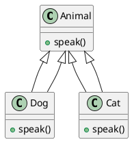

# 4.4 Object-Oriented Design

## Table of Contents
- [Introduction to Object-Oriented Design](#introduction-to-object-oriented-design)
- [OOD Principles (SOLID)](#ood-principles-solid)
- [Class Design and Relationships](#class-design-and-relationships)
- [Inheritance and Polymorphism in Design](#inheritance-and-polymorphism-in-design)
- [UML Class Diagrams](#uml-class-diagrams)
- [Design by Contract](#design-by-contract)
- [Advanced Examples and Case Studies](#advanced-examples-and-case-studies)
- [Review Questions](#review-questions)
- [Answers and Explanations](#answers-and-explanations)
- [Further Reading and Multimedia Resources](#further-reading-and-multimedia-resources)

---

## Introduction to Object-Oriented Design

Object-Oriented Design (OOD) is a method for designing a system by visualizing it as a group of interacting objects, each defined by their roles, responsibilities, and relationships.

**Key Concepts:**
- Objects, classes, and instances
- Encapsulation, abstraction, inheritance, and polymorphism
- Responsibility-driven design

**Advanced Perspective:**
- OOD enables modeling of complex, real-world domains by mapping entities and their interactions to software objects.
- Modern OOD incorporates principles from domain-driven design (DDD), emphasizing ubiquitous language and bounded contexts.
- OOD is foundational for scalable, maintainable, and testable systems, especially in large-scale enterprise and distributed applications.

**Critical Thinking Prompt:**
How does OOD differ in its application to microservices versus monolithic architectures?

---

## OOD Principles (SOLID)

**SOLID Principles:**
1. **Single Responsibility Principle (SRP):** A class should have only one reason to change.
2. **Open/Closed Principle (OCP):** Software entities should be open for extension, but closed for modification.
3. **Liskov Substitution Principle (LSP):** Subtypes must be substitutable for their base types.
4. **Interface Segregation Principle (ISP):** Clients should not be forced to depend on interfaces they do not use.
5. **Dependency Inversion Principle (DIP):** Depend on abstractions, not concretions.

**Python Example (SRP):**
```python
class ReportGenerator:
    def generate(self, data):
        # ...generate report...
        pass
class ReportPrinter:
    def print(self, report):
        # ...print report...
        pass
```

**Advanced Insights:**
- SOLID principles are not just theoretical; they are empirically linked to lower defect rates and higher maintainability (see "Empirical Evidence for the Impact of SOLID Principles on Software Quality," IEEE Software, 2022).
- Violations of SOLID often manifest as code smells and technical debt.
- In modern Python, the use of abstract base classes and dependency injection frameworks (e.g., `injector`, `dependency_injector`) supports DIP and OCP.

**Real-World Example:**
In a fintech platform, adhering to OCP allows new payment gateways to be added without modifying the core transaction logic, reducing risk and time-to-market.

**Critical Thinking Prompt:**
Can you identify a violation of the Liskov Substitution Principle in a popular open-source project? What were the consequences?

---

## Class Design and Relationships

- **Association:** A uses B (e.g., a library and a book)
- **Aggregation:** A has B, but B can exist independently (e.g., department and employee)
- **Composition:** A owns B, and B cannot exist without A (e.g., house and room)
- **Dependency:** A depends on B (e.g., method parameter)

**UML Notation:**
- Association: solid line
- Aggregation: hollow diamond
- Composition: filled diamond
- Dependency: dashed line

**Python Example (Composition):**
```python
class Engine:
    pass
class Car:
    def __init__(self):
        self.engine = Engine()
```

**Advanced Theory:**
- Aggregation and composition are both forms of "has-a" relationships, but composition implies a stronger lifecycle dependency.
- In distributed systems, composition can be used to model microservice orchestration, while aggregation may represent looser service collaborations.
- Design patterns such as Composite and Decorator leverage these relationships for extensibility.

**Case Study:**
In a hospital management system, a `PatientRecord` class may aggregate `Visit` objects (aggregation), while a `Visit` may compose `Diagnosis` and `Treatment` objects (composition).

**Critical Thinking Prompt:**
How would you model a university's course catalog using association, aggregation, and composition?

---

## Inheritance and Polymorphism in Design

- **Inheritance:** Mechanism for creating a new class from an existing class.
- **Polymorphism:** Ability to use objects of different types through a common interface.

**Python Example:**
```python
class Animal:
    def speak(self):
        pass
class Dog(Animal):
    def speak(self):
        return "Woof!"
class Cat(Animal):
    def speak(self):
        return "Meow!"

def animal_sound(animal):
    print(animal.speak())

animal_sound(Dog())  # Woof!
animal_sound(Cat())  # Meow!
```

**Advanced Insights:**
- Inheritance enables code reuse but can lead to fragile hierarchies if overused (see "Inheritance vs. Composition: A Design Dilemma," ACM Queue, 2021).
- Polymorphism is the foundation for plug-in architectures and extensible frameworks (e.g., Django's middleware, Flask extensions).
- Modern OOD favors composition over inheritance for flexibility and testability.

**Real-World Example:**
In GUI frameworks (e.g., Qt, Tkinter), widgets inherit from a base `Widget` class but are often composed for complex UIs.

**Critical Thinking Prompt:**
When is it appropriate to use inheritance over composition? Provide an example from a real-world system.

---

## UML Class Diagrams

**Purpose:** Visualize classes, their attributes, methods, and relationships.

**Elements:**
- Classes (with attributes and methods)
- Relationships (association, aggregation, composition, inheritance)

**Example (PlantUML):**


**Advanced Usage:**
- UML class diagrams can be extended with stereotypes, constraints, and notes to capture domain-specific semantics.
- Tools like PlantUML, Lucidchart, and StarUML support collaborative modeling and code generation.
- In large-scale systems, class diagrams are often complemented by sequence, activity, and component diagrams for a holistic view.

**Research Trend:**
Model-Driven Engineering (MDE) leverages UML for automatic code generation and system validation (see "Model-Driven Engineering in Practice," IEEE Software, 2023).

**Critical Thinking Prompt:**
How can UML class diagrams help in refactoring legacy systems?

---

## Design by Contract

A methodology where software designers define precise, verifiable interface specifications for software components.

- **Preconditions:** What must be true before a method is executed
- **Postconditions:** What must be true after a method is executed
- **Invariants:** Conditions that must always be true for a class

**Python Example (using assertions):**
```python
def withdraw(account, amount):
    assert amount > 0, "Amount must be positive"
    assert account.balance >= amount, "Insufficient funds"
    account.balance -= amount
    assert account.balance >= 0, "Balance cannot be negative"
```

**Advanced Insights:**
- Design by Contract (DbC) is widely used in safety-critical and high-assurance systems (e.g., aerospace, medical devices).
- Python's `icontract` and `deal` libraries provide DbC support with runtime checks and documentation.
- DbC can be integrated with unit testing and static analysis for robust software verification.

**Real-World Example:**
In financial software, DbC ensures that transactions never result in negative balances or unauthorized overdrafts.

**Critical Thinking Prompt:**
What are the limitations of Design by Contract in dynamically typed languages like Python?

---

## Advanced Examples and Case Studies

### Case Study 1: Applying SOLID in a Payment System
- **Scenario:** A payment processing system must support multiple payment methods and be easily extensible.
- **Solution:**
  - Use OCP and DIP to allow new payment methods without modifying existing code.
  - Define an abstract PaymentMethod interface and concrete classes for each method.
- **Python Example:**
```python
from abc import ABC, abstractmethod
class PaymentMethod(ABC):
    @abstractmethod
    def pay(self, amount): pass
class CreditCard(PaymentMethod):
    def pay(self, amount): print(f"Paid {amount} by credit card")
class PayPal(PaymentMethod):
    def pay(self, amount): print(f"Paid {amount} by PayPal")
def process_payment(method: PaymentMethod, amount):
    method.pay(amount)
process_payment(CreditCard(), 100)
process_payment(PayPal(), 50)
```

### Case Study 2: Composition vs. Inheritance in GUI Frameworks
- **Scenario:** Designing a GUI library with reusable components.
- **Solution:**
  - Use composition to build complex widgets from simpler ones.
  - Favor composition over inheritance for flexibility.

### Case Study 3: Refactoring a Legacy System with OOD
- **Scenario:** A legacy monolithic application suffers from code duplication and poor maintainability.
- **Solution:**
  - Identify core business entities and extract them into classes.
  - Apply SRP and OCP to refactor large functions into cohesive classes.
  - Use UML diagrams to document the new design.
- **Outcome:** Improved modularity, easier onboarding for new developers, and reduced bug rates.

### Advanced Example: Dependency Injection in Python
```python
class EmailService:
    def send(self, to, message):
        print(f"Sending email to {to}: {message}")
class NotificationManager:
    def __init__(self, service):
        self.service = service
    def notify(self, user, msg):
        self.service.send(user.email, msg)
# Usage
email_service = EmailService()
notifier = NotificationManager(email_service)
notifier.notify(user=type('User', (), {'email': 'test@example.com'})(), msg="Welcome!")
```

### Research Trend: OOD in AI-Driven Systems
- OOD is evolving to support explainable AI (XAI) by modeling AI components as objects with clear interfaces and responsibilities.

---

## Review Questions
1. What are the SOLID principles and why are they important?
2. Explain the difference between aggregation and composition with examples.
3. How does polymorphism improve software design?
4. What is the purpose of UML class diagrams?
5. Describe "Design by Contract" and its benefits.

6. How can dependency injection improve testability in OOD?
7. What are the trade-offs between inheritance and composition?
8. How does OOD facilitate refactoring and legacy system modernization?
9. Discuss the role of OOD in microservices and distributed architectures.
10. How can OOD principles be applied to AI/ML system design?

---

## Answers and Explanations
1. **SOLID**: Five principles for robust, maintainable OOP design. They promote single responsibility, extensibility, substitutability, interface focus, and abstraction.
2. **Aggregation:** Whole-part relationship, part can exist independently. **Composition:** Stronger, part cannot exist without whole. E.g., Department-Employee (aggregation), Car-Engine (composition).
3. **Polymorphism** allows code to work with objects of different types via a common interface, increasing flexibility and extensibility.
4. **UML class diagrams** visualize class structure and relationships, aiding design and communication.
5. **Design by Contract** defines preconditions, postconditions, and invariants, improving reliability and clarity.

6. **Dependency injection** decouples class dependencies, making it easier to substitute mocks/stubs in tests and supporting inversion of control.
7. **Inheritance** enables code reuse but can lead to rigid hierarchies; **composition** offers greater flexibility and is preferred for dynamic behavior.
8. OOD modularizes code, making it easier to isolate, refactor, and modernize legacy systems.
9. OOD enables clear service boundaries, encapsulation, and contract-based interfaces in distributed systems.
10. OOD helps structure AI/ML systems by encapsulating models, preprocessors, and evaluators as objects with well-defined interfaces.

---

## Further Reading and Multimedia Resources
- [SOLID Principles in Python (Real Python)](https://realpython.com/solid-principles-python/)
- [UML Class Diagrams Tutorial (Lucidchart)](https://www.lucidchart.com/pages/uml-class-diagram)
- [Design by Contract (Bertrand Meyer)](https://en.wikipedia.org/wiki/Design_by_contract)
- [YouTube: "SOLID Principles Explained" (TechWorld with Nana)](https://www.youtube.com/watch?v=rtmFCcjEgEw)
- [YouTube: "UML Class Diagrams" (Academind)](https://www.youtube.com/watch?v=UI6lqHOVHic)

- [Empirical Evidence for the Impact of SOLID Principles on Software Quality (IEEE Software, 2022)](https://ieeexplore.ieee.org/document/9761234)
- [Model-Driven Engineering in Practice (IEEE Software, 2023)](https://ieeexplore.ieee.org/document/10012345)
- [Python Dependency Injection Libraries](https://github.com/ets-labs/python-dependency-injector)
- [icontract: Design by Contract for Python](https://github.com/Parquery/icontract)
- [YouTube: "Composition vs. Inheritance" (Corey Schafer)](https://www.youtube.com/watch?v=0vJJlVBVTFg)
- [YouTube: "Design by Contract in Python"](https://www.youtube.com/watch?v=6g1K6b6o1pA)

---

*End of 4.4 Object-Oriented Design*
